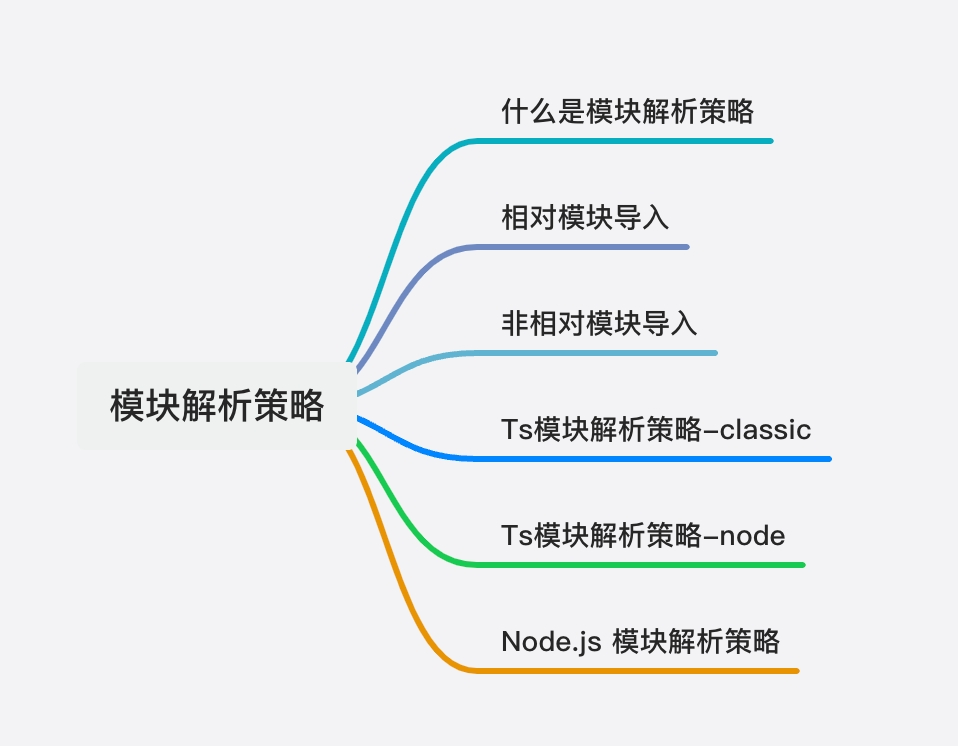
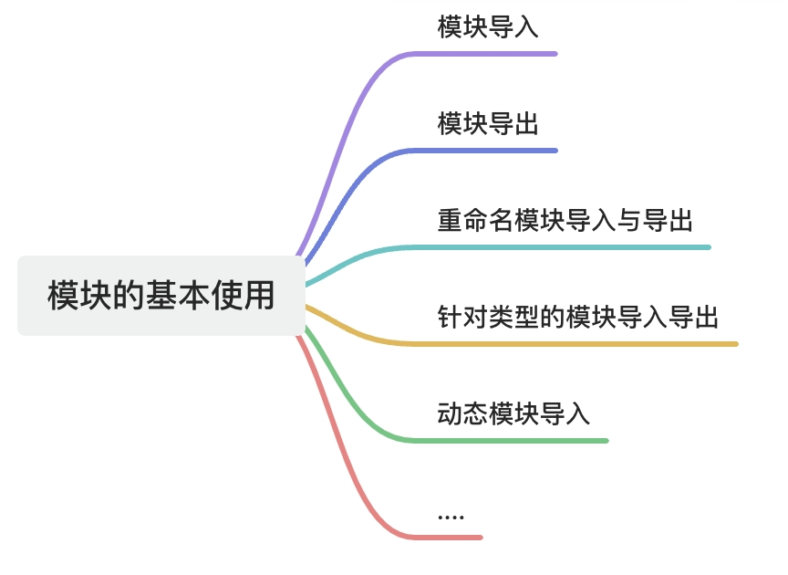
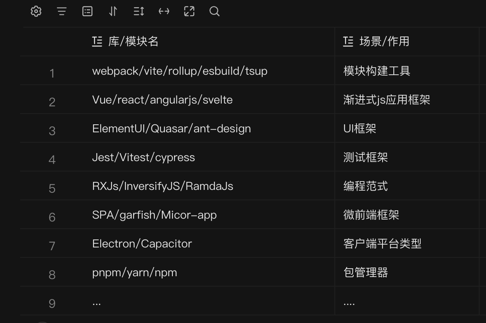

# 前端模块化

## 导览
文章主线内容，如下图：


### 模块化方案的演进，示意图如下：


### 模块解析策略，示意图如下：


### 模块的基本使用，如下：


### 常用优秀模块库/工具，示意图如下：



## 为什么需要模块化规范？
回想下前端最初的样子，三剑客（HTML、CSS、JS），在网页web环境下，以下最简单部分：

```html
<!DOCTYPE html>
<html>
    <head>
<!--         有网页各种依赖的第三方库 -->
        <script src="https://cdn.jsdelivr.net/npm/axios@1.2.1/dist/axios.min.js"></script>
        <script src="./app.js" type="text/script"></script>
<!--         有网页各种自定义操作 .... -->
    </head>
    <body>
        <h1>Hello World</h1>
    </body>
    <script>
        console.log('123')
    </script>
</html>
```

上述暴露了开发中会暴露出 **污染全局作用域**，**命名冲突问题**，不易管理有依赖关系执行的代码，进而不利于大型项目或多人开发的效率，同时孕育了社区开发人员提供了各场景的模块化方案的环境，但最终ESMAScript规范，官方层面提供了模块化编程技术的规范。

## 模块化的技术

避免对全局作用域的影响，采用了 **闭包、IIFE(立即执行函数)** 的技术方式，从而使文件代码产生的变量、方法，存在局部作用域中，局部变量也会在代码执行完后自动回收销毁，同时减少文件模块中代码对外部产生的 **副作用**。

## 模块化方案的演进
Js语言遵循的ESMAScript规范，从 1996 至 2015 近20年的时间里，语言本身没有对模块化编程的设计与实现。2015年ES6(ESMAScript2015)的发布，才告别了这一情况。

长时间社区开发者依赖前期模块规范开发的发展，对应所产生的众多软件、第三方依赖包（npm包）等公共资源依旧使用它们，所以了解他们是有必要的。

站在此刻，ESM模块成为了开发者最优选，但浏览器厂商对ES6的支持存在差异，同时也出现如Babel优秀转码器或如webpack等模块打包工具，转化支持良好的格式，也涌现出优秀的库、工具等周边生态。

### CommonJs方案
CommonJs模块化方案是一个重要用于 服务端 javascript程序的模块系统。同年2009年11月Google研发的`nodeJs`是我们熟知的服务端语言,  Node应用由模块组成，其模块系统依据CommonJS模块规范。

2010 年 1 月，为 Node.js 环境引入了一个名为npm包管理器。

自此更多开发者开发、维护优秀的模块依赖。同时，开发者减少了重复开发时间，引入第三方模块依赖到自己项目。

CommonJs用require语句声明对其他模块的依赖，使用exports来导出当前模块所声明的。如Node.js程序中，一个js文件作为一个模块。

### AMD方案
随着浏览器网页端web的普及，最初CommonJs模块方案无法给浏览器模块加载带来很好的体验，针对最强浏览器端模块化编程解决方案的孕育而生AMD规范。

CommonJs模块不能满足要求，主要：
* 它采取同步加载的方式价值模块文件，但在浏览器中同步加载网络资源显然不可取，带来不好的用户体验。
* 浏览器环境中js引擎不支持CommonJs模块，无法直接运行该方案的代码。

所以基于浏览器环境，设计出异步模块定义的方案（AMD），网页浏览器（C端）普及的背景下，这历史节点该模块方案问世。

AMD模块系统不是将一个文件作为一个模块，使用define函数来注册一个模块，而在一个文件中允许同时定义多个模块。AMD模块系统中也提供了require函数用来声明对其他模块的依赖，同时还提供了exports语句用来导出当前模块内的声明。具体介绍与实现requirejs 官网查看。

### CMD方案
CMD规范与AMD类似，同样针对浏览器web异步模块加载，其中一处明显区别AMD规范，模块申明的依赖前置，一定会加载，而CMD规范则是依赖就近，延迟执行。 

按需加载，需要用到时再require。

### UMD方案 
UMD规范是Universal Module Definition的缩写，Universal单词是通用的意思，是解决在服务端为代表的CommonJs规范与以浏览器环境代表的AMD规范，两者代码互相不能兼容使用的问题。

为达成一套代码适配可运行在服务端又可运行在浏览器中，减少因环境不同，却维护相同功能的代码的场景。

实现其实判断环境参数，CommonJs模块规范中的module.exports与AMD模块规范的define函数哪个符合，执行相关代码。

### ESM方案
ECMAScript模块是JavaScript语言的标准模块，因此TypeScript也支持ECMAScript模块。

每个模块都拥有独立的模块作用域，模块中的代码在其独立的作用域内运行，而不会影响模块外的作用域（有副作用的模块除外）。

模块通过import语句来声明对其他模块的依赖；同时，通过export语句将模块内的声明公开给其他模块使用。

## 示例代码

```ts
// @filename: index.ts
import { valueOfPi } from "./constants";
 
export const twoPi = valueOfPi * 2;
```

转化为CommonJS，如下：
```js
"use strict";
Object.defineProperty(exports, "__esModule", { value: true });
exports.twoPi = void 0;
const constants_1 = require("./constants");
exports.twoPi = constants_1.valueOfPi * 2;
```

转化为AMD，如下：
```js
define(["require", "exports", "./constants"], function (require, exports, constants_1) {
    "use strict";
    Object.defineProperty(exports, "__esModule", { value: true });
    exports.twoPi = void 0;
    exports.twoPi = constants_1.valueOfPi * 2;
});
```

转化为UMD，如下：
```js
(function (factory) {
    if (typeof module === "object" && typeof module.exports === "object") {
        var v = factory(require, exports);
        if (v !== undefined) module.exports = v;
    }
    else if (typeof define === "function" && define.amd) {
        define(["require", "exports", "./constants"], factory);
    }
})(function (require, exports) {
    "use strict";
    Object.defineProperty(exports, "__esModule", { value: true });
    exports.twoPi = void 0;
    const constants_1 = require("./constants");
    exports.twoPi = constants_1.valueOfPi * 2;
});
```


## 模块解析策略
当我们程序代码中导入了一个模块时，编译器或者运行时会去查找并读取导入模块的定义，我们将该过程叫作**模块解析**。

如`import { a } from "moduleA"`, 代码上下文引用了a变量，编译器需要确切的清楚与检查moduleA的定义。

moduleA可以是.js、.ts、.tsx文件之一或者.d.ts代码所依赖的文件定义。

因此引入方式有：**相对模块引入**与**非相对模块引入**。
编译器怎样如何去寻找moduleA模块的，为此编译器根据模块解析策略去寻找解析。

NodeJs语言编译器，对CommonJs模块的解析策略，可查看node官网介绍。
本文以Ts语言编译器来解释较为全面，有几种解析策略，官网粘贴如下
* 'node' for Node.js’ CommonJS implementation
* 'node16' or 'nodenext' for Node.js’ ECMAScript Module Support from TypeScript 4.7 onwards
* 'classic' used in TypeScript before the release of 1.6. You probably won’t need to use classic in modern code

从上述描述得知，classic是曾经的模块解析策略，主要用于向后兼容，现代编码场景已使用不上。node与 nodenext是对nodeJsESM格式模块支持。

#### 相对模块导入
如上述模块导入语句中，若moudleA为以下符合开始，那么它就是相对模块导入。
* ./
* ../
* /

#### 非相对模块导入
在模块导入语句中，若模块名不是以“/”、“./”和“../”符号开始，那么它就是非相对模块导入。一般为第三方模块包。
```ts
import { Observable } from 'rxjs'
import { ref } from 'vue'
```

#### Ts模块解析策略-classic
classic是曾经的模块解析策略，主要用于向后兼容。但也可以了解下。
源文件/root/src/folder/A.ts路径中的文件，代码如下：
相对模块引入：
import { b } from "./moduleB"，解析策略会有以下查找：
1. /root/src/folder/moduleB.ts
2. /root/src/folder/moduleB.d.ts
然后，非相对模块引入，则向上遍历目录树：
import { b } from "moduleB"，解析策略会有以下查找：
1. /root/src/folder/moduleB.ts
2. /root/src/folder/moduleB.d.ts
3. /root/src/moduleB.ts
4. /root/src/moduleB.d.ts
5. /root/moduleB.ts
6. /root/moduleB.d.ts
7. /moduleB.ts
8. /moduleB.d.ts

观察得知，有一个最大的不同，classic向上解析检查文件是否存在，不在node_modules寻找


#### TS模块解析策略-node
typeScript 将模仿 Node.js 运行时解析策略，以便在编译时定位模块的定义文件。为此，TypeScript 将 TypeScript 源文件扩展名（.ts、.tsx和.d.ts）覆盖在 Node 的解析逻辑上。TypeScript 还将使用package.json 中的types字段来实现镜像的目的"main"——编译器将使用它来查找“主”定义文件以供参考。

源文件/root/src/folder/A.ts路径中的文件，代码如下：
**相对模块引入：**
import { b } from "./moduleB"，解析策略会有以下查找：
1. /root/src/moduleB.ts
2. /root/src/moduleB.tsx
3. /root/src/moduleB.d.ts
4. /root/src/moduleB/package.json（如果它指定了一个types属性）
5. /root/src/moduleB/index.ts
6. /root/src/moduleB/index.tsx
7. /root/src/moduleB/index.d.ts
**非相对模块引入**
则向上遍历目录树中的node_modules, import { b } from "moduleB"，解析策略会有以下查找：
1. /root/src/node_modules/moduleB.ts
2. /root/src/node_modules/moduleB.tsx
3. /root/src/node_modules/moduleB.d.ts
4. /root/src/node_modules/moduleB/package.json（如果它指定了一个types属性）
5. /root/src/node_modules/@types/moduleB.d.ts
6. /root/src/node_modules/moduleB/index.ts
7. /root/src/node_modules/moduleB/index.tsx
8. /root/src/node_modules/moduleB/index.d.ts
9. /root/node_modules/moduleB.ts
10. /root/node_modules/moduleB.tsx
11. /root/node_modules/moduleB.d.ts
12. /root/node_modules/moduleB/package.json（如果它指定了一个types属性）
13. /root/node_modules/@types/moduleB.d.ts
14. /root/node_modules/moduleB/index.ts
15. /root/node_modules/moduleB/index.tsx
16. /root/node_modules/moduleB/index.d.ts
17. /node_modules/moduleB.ts
18. /node_modules/moduleB.tsx
19. /node_modules/moduleB.d.ts
20. /node_modules/moduleB/package.json（如果它指定了一个types属性）
21. /node_modules/@types/moduleB.d.ts
22. /node_modules/moduleB/index.ts
23. /node_modules/moduleB/index.tsx
24. /node_modules/moduleB/index.d.ts


### NodeJs模块的解析策略
上述提到Ts中node解析策略师模仿node.js运行时的解析策略，也总结了解下Node.js如何解析模块的。

Node.js我们了解它遵循CommonJS模块规范，使用require来导入模块，通过以下例子展示下。

源文件/root/src/folder/A.js路径中的文件，其中代码包含如下：
相对模块引入：
const x = require("./moduleB")，Node.js解析策略会有以下顺序查找：
1. 询问文件/root/src/folder/moduleB.js, 是否存在
2. 询问文件夹/root/src/moduleB是否包含package.json指定"main"模块的指定文件。在我们的示例中，如果 Node.js 找到/root/src/moduleB/package.json包含的文件{ "main": "lib/mainModule.js" }，则 Node.js 将引用/root/src/moduleB/lib/mainModule.js。
3. 询问文件夹/root/src/moduleB是否包含名为index.js. 该文件隐含地被认为是该文件夹的“主”模块。
然后，非相对模块引入，则向上遍历目录树中的node_modules, const x = require("moduleB")，解析策略会有以下查找：
1. /root/src/node_modules/moduleB.js
2. /root/src/node_modules/moduleB/package.json（如果它指定了一个"main"属性）
3. /root/src/node_modules/moduleB/index.js


4. /root/node_modules/moduleB.js
5. /root/node_modules/moduleB/package.json（如果它指定了一个"main"属性）
6. /root/node_modules/moduleB/index.js


7. /node_modules/moduleB.js
8. /node_modules/moduleB/package.json（如果它指定了一个"main"属性）
9. /node_modules/moduleB/index.js

更多的Node.js运行时，模块加载解析的文档，请跳转查看 loading modules fromnode_modules.


## 模块的用法
不同的模块化方案（ESM、CommonJs、UMD等），代码对应的写法也不相同。

以下以ESM模块规范来总结常用模块的用法。

模块导出
模块导出语句包含以下：
* 命名模块导出。
* 默认模块导出。
* 聚合模块

```js
export const c = 0

export function f() {}

export class C {}

export interface I {}

export type Numberic = number | bigint

// 模块导出列表（一次性导出多个声明）, 且可以存在多个模块导出列表

export {
  f0: () => {},
  name: 'yyi'
}

// 模块默认导出
export default function() {}

// 由于默认模块导出相当于名为“default”的命名模块导出，因此，默认模块导出也可以写为如下形式：
function f() {}

export {
  f as default
}

// 聚合模块是指将其他模块的模块导出作为当前模块的模块导出。
// 聚合模块使用“export ... from ...”语法并包含以下形式：
export { a, b } from 'mod'
export { a as default } from 'mod'
// 从模块mod中选择所有非默认模块导出作为当前模块的模块导出
export * from 'mod'
```

#### 模块导入
模块导入语句包含以下：
* 导入命名模块导出
* 导入整个模块
* 导入默认模块导出
* 空导入

```js
import { a, b } from 'mod'

// 将模块mod中的所有命名模块导出导入到对象ns中。
import * as ns from 'mod'

// 导入默认模块导出
import modDefault from 'mod'

// 空导入语句不会导入任何模块导出，它只是执行模块内的代码。空导入的用途是“导入”模块的副作用。
import 'mod'

```

#### 重命名模块导入和导出
语句包含以下：
* 重命名模块导出
* 重命名聚合模块
* 重命名模块导入

```js
export {
  oldName as newName
}

// 在该语法中，将导出mod模块内的oldName声明，并将其重命名为newName
export { oldName as newName } from 'mod'

import { oldName as newName } from 'mod'
```

#### 动态模块导入
介绍：
动态模块导入允许在一定条件下按需加载模块，而不是在模块文件的起始位置一次性导入所有依赖的模块。因此，动态模块导入可能会提升一定的性能。动态模块导入通过调用特殊的“import()”函数来实现。

该函数接受一个模块路径作为参数，并返回Promise对象。如果能够成功加载模块，那么Promise对象的完成值为模块对象。动态模块导入语句不必出现在模块的顶层代码中，它可以被用在任意位置，甚至可以在非模块中使用。

假设同目录存在a.ts、b.ts文件:
a.ts 文件内容如下：
export function add (x:number, y:number) {
  return x + y
}
b.ts 文件内容如下：
setTimeout(() => {
  import('./b').then((result) => {
    console.log(result.add(1, 2))
  }).catch(err => console.log(err))
}, 1000)


## 参考资料
* https://www.typescriptlang.org/tsconfig#moduleResolution
* https://nodejs.org/api/modules.html#modules_all_together
