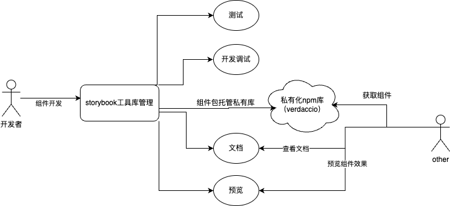

# 组件化

如上图，前端组件化是一种将前端页面或应用拆分成独立的、可重用的组件的方法，旨在提高开发效率、减少代码冗余、增强可维护性和可扩展性。在组件化的开发模式下，每个组件都有自己的结构、样式、逻辑和状态，通过组合不同的组件可以构建出复杂的页面或平台应用。

**思维**

作为技术开发人员，将公司的产品视为整体与开发导向，会使用我们陷入无限的产品与工作重复，降低生产力与效能。

重复性、麻木思维，会使开发能力僵化与工作热情降低。因为我们知道呈现给用户侧的多样化产品的背后，其实无数个可服用组件，推积木一样搭建而成，着重点技术封装与积累，带来后续产品的效率与健壮。

**组件工具库**

* [storybook](https://storybook.js.org/docs/7.0/vue/get-started/why-storybook) Storybook 提供组件查看、测试、生成文档等功能
* [verdaccio](https://hub.docker.com/r/verdaccio/verdaccio) npm仓库的私有源, 组件包和工具包上传的地方
* [bit](https://bit.dev/docs/thinking-in-components) 提供UI组件平台和脚本命令上传

工程常见方式(storybook + verdaccio)

其中，Bit类似git的方式一样，是分布式的组件管理工具库，它有自己存储的地方，然后通过cli可在不同业务项目中，提取需上传的组件去上传。

而storybook场景更多侧重，专门UI组件的仓库，类似ant、quasar、element-plus那样UI框架的管理。